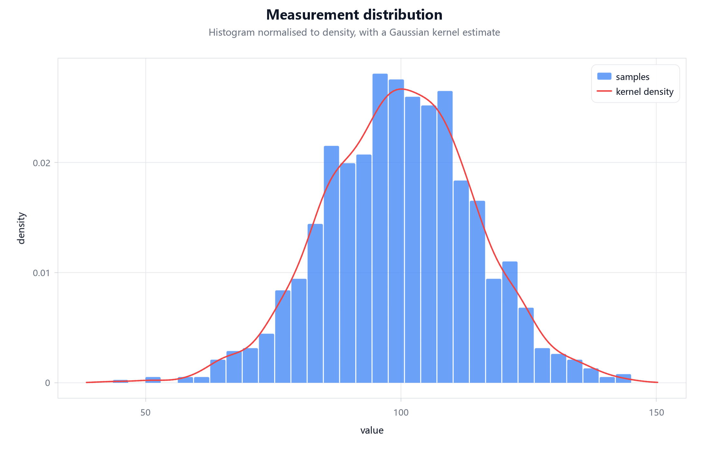
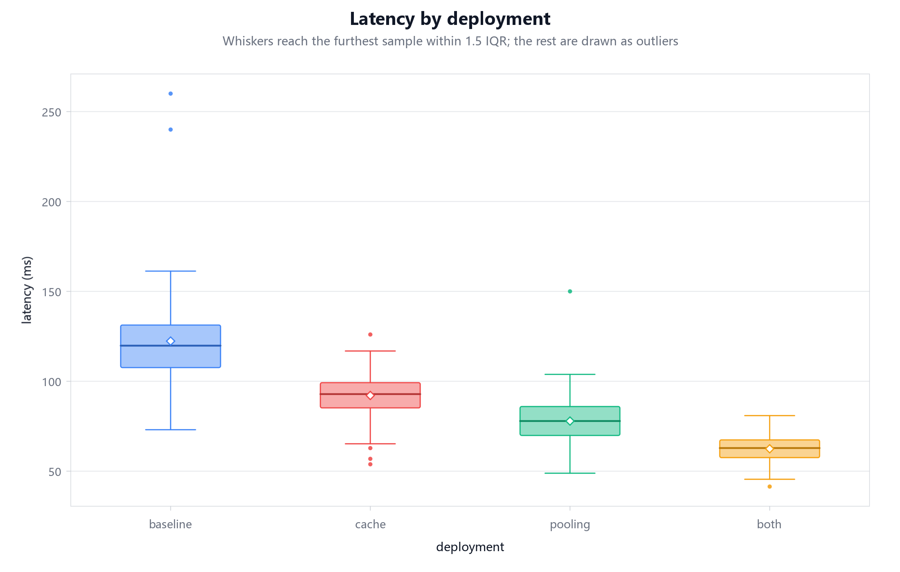
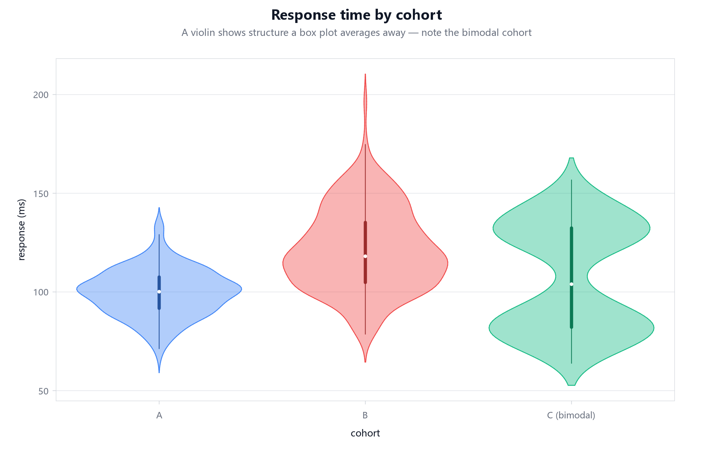

# 比较两组分布

## 目标

用两张采用相同范围和分箱数的直方图，再配一张箱线图和一张小提琴图，比较“基线”与“优化后”两组延迟。这样每种视图都实际覆盖两组数据，避免只画一组直方图却声称完成组间比较。







三张画廊图均来自 `examples/src/distribution.cj`，SHA-256 依次为 `6fdb5443b0b1867e011b293a17ca89f1c57795ee50a0dce9d896584f802bb05a`、`a9890c3fb3fe4fb897b6d581f1d0e9a6915da18106d2fb32e01d173712b31395`、`826667a6332f47e518764a7dbcd54cd822875b743fb0dd239c14b47501246a0c`。

## 适用场景

当每组都有一批原始样本，需要比较中心、散布、异常值和形状时使用。样本极少时优先显示原始点；只有均值与误差时使用[误差和置信带](show-uncertainty.md)。

## 准备工作

两组必须使用同一单位。比较直方图时固定共同 `Bounds` 与相同 bins；否则每张图自动选择不同区间，柱高不能直接比较。下面固定小样本是为了可复现，真实分析应保留更大样本并说明抽样过程。

## 操作步骤

程序构建 2×2 网格。前两格各画一组直方图，但范围和分箱规则一致；第三格用共同类别轴的 BoxPlotSeries；第四格用 ViolinSeries。四格一起回答“中心是否降低、波动是否收窄、形状是否改变”。

```cangjie verify role=complete
package guide_examples

import plot.{Figure, FigureExport}
import plot.core.{Bounds, CategoryScale}
import plot.series.{BoxPlotSeries, HistogramSeries, ViolinSeries}

main(): Unit {
    let baseline = [78.0, 82.0, 85.0, 88.0, 91.0, 94.0, 96.0, 101.0, 105.0, 112.0, 126.0, 148.0]
    let optimized = [61.0, 64.0, 66.0, 68.0, 70.0, 71.0, 73.0, 75.0, 77.0, 80.0, 84.0, 91.0]
    let range = Bounds(55.0, 155.0)
    let figure = Figure("部署前后延迟分布")
    figure.setGrid(2, 2)

    let before = figure.addAxes()
    before.title = "基线直方图"
    let beforeHist = HistogramSeries(baseline, bins: 8)
    beforeHist.setRange(range)
    before.add(beforeHist)

    let after = figure.addAxes()
    after.title = "优化后直方图"
    let afterHist = HistogramSeries(optimized, bins: 8)
    afterHist.setRange(range)
    after.add(afterHist)

    let boxes = figure.addAxes()
    boxes.title = "箱线摘要"
    boxes.setXScale(CategoryScale(["基线", "优化后"]))
    boxes.add(BoxPlotSeries([baseline, optimized]))

    let violins = figure.addAxes()
    violins.title = "密度形状"
    violins.setXScale(CategoryScale(["基线", "优化后"]))
    violins.add(ViolinSeries([baseline, optimized]))

    FigureExport.renderToPng(figure, "distributions.png", width: 1100, height: 820)
    println("已写入 distributions.png") // 输出: 已写入 distributions.png
}
```

下面变化用于敏感性检查：改变分箱数与小提琴带宽后重新导出。如果“优化后更集中”的结论只在某个参数下出现，就不应把它写成稳定结论。

```cangjie role=variation
let detailed = HistogramSeries(optimized, bins: 12, label: "12 个分箱")
detailed.setRange(Bounds(55.0, 155.0))
axes.add(detailed)
let smooth = ViolinSeries([baseline, optimized])
smooth.bandwidth = Some(7.5)
smooth.showBox = true
otherAxes.add(smooth)
```

## 确认结果

文件应存在且可打开。两个直方图的横轴范围相同；优化后样本整体更靠左、跨度更窄。箱线图显示两组中位数与四分位范围，小提琴图显示各自形状。尝试 bins 为 6、8、12，以及不同合理 bandwidth，确认主要结论不因一个任意参数消失。

## 常见错误

给每组直方图不同范围、把 Count 与 Density 叠在同一纵轴、用光滑小提琴掩盖极小样本，都会造成误读。`Count` 回答每个区间有多少样本；`Frequency` 让柱高之和为 1；`Density` 让总面积为 1。箱线图压缩了多峰结构，小提琴图又受带宽影响，因此两者适合互相补充。

## 相关 API

- [`HistogramSeries`](../../api/plot/series/HistogramSeries.md)：固定范围与分箱统计。
- [`BoxPlotSeries`](../../api/plot/series/BoxPlotSeries.md)：比较中位数、四分位和异常点。
- [`ViolinSeries`](../../api/plot/series/ViolinSeries.md)：比较经平滑后的分布形状。

## 下一步

继续阅读[二维场与色图](../concepts/field-data-and-colormaps.md)，把一维样本比较扩展到位置网格上的连续值。
