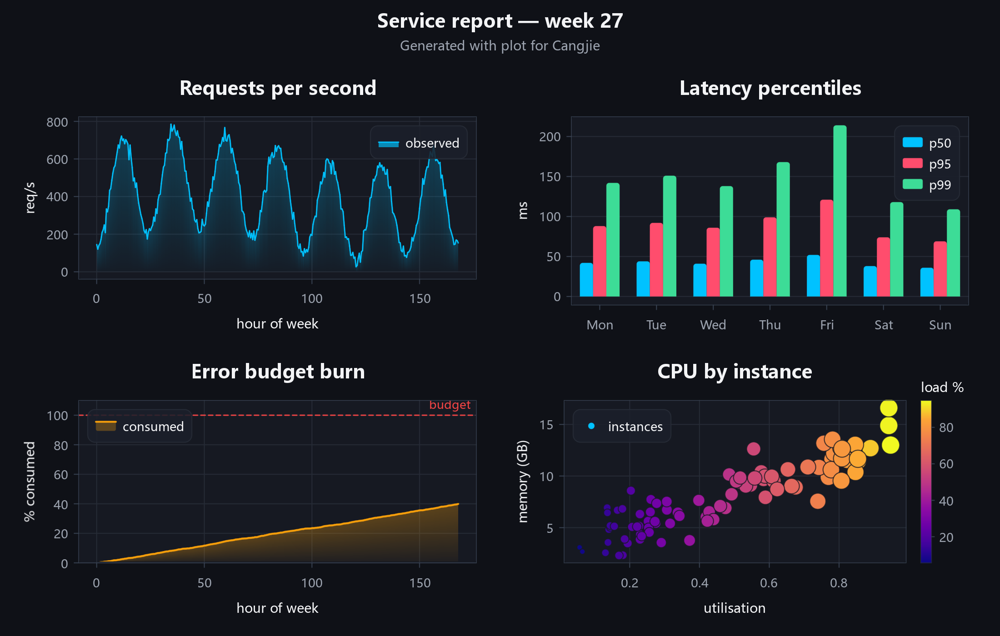

# 构建可复用的交互仪表板

## 你将完成

本教程把首图扩展为一张真正可用于检查业务状态的四面板仪表板。最终窗口包含趋势折线、分类柱形、目标区间和带色标的散点图，还提供标准工具栏、悬停读数与光标坐标。关键成果不只是“画得更多”，而是把构图代码放进 `buildDashboard(): Figure`：桌面程序可以显示它，批处理程序也能把同一个 Figure 导出，不再复制图表逻辑。



官方画廊图来自 `examples/src/composite.cj`，SHA-256 为 `971e633ea8d929d848ff1c63631ffe326d7c3cfc9ff425fa3eb5771602756b51`。本教程使用较短的固定数据，便于理解和复现；面板布局与交互入口应与画廊所展示的能力一致。

## 开始之前

先完成[第一张折线图](../getting-started/first-chart.md)，确认 `cjpm run` 能打开 Plot 窗口。下面仍只依赖 Plot，不需要项目示例中的 `Data` 辅助类型。请保留完整程序，先编译运行，再逐步替换成自己的数据。四个面板中的数组长度都必须对应；散点颜色数组也必须与点数相同。

## 先建立一个模型

仪表板不是四张彼此无关的图片。`Figure.setGrid(2, 2)` 定义整体版面，四次 `addAxes()` 按加入顺序占据网格。每个 `Axes` 独立保存标题、坐标范围和系列，因此趋势面板使用连续数值轴，分类面板可以改用 `CategoryScale`。窗口只接收最终 Figure，并在其上叠加工具栏和读数组件。这样分层后，构图函数没有窗口副作用，测试、导出和桌面显示都能复用。

## 操作步骤

1. 先创建 Figure，设置 2×2 网格；不要先开四个窗口。
2. 为每个问题建立一个面板：趋势、按渠道比较、目标区间、点之间的关系。
3. 给散点的第三个变量设置连续色图，并同步创建 `ColorBar`；颜色没有色标就无法解释。
4. 让 `buildDashboard` 返回 Figure。`main` 只负责选择窗口尺寸、添加标准交互和调用 `show`。
5. 运行后依次检查四个面板，再用滚轮缩放、拖动平移、悬停数据点并点击复位按钮。

## 完整程序

```cangjie verify role=complete profile=gui-visual
package guide_examples

import plot.{Figure, PlotWindow, WindowOptions}
import plot.axes.ColorBar
import plot.core.{Bounds, CategoryScale, Colormap}
import plot.series.{AreaSeries, BarSeries, LineSeries, ScatterSeries}

func buildDashboard(): Figure {
    let figure = Figure("运营概览")
    figure.subtitle = "同一份 Figure 可用于窗口和文件导出"
    figure.setGrid(2, 2)

    let trend = figure.addAxes()
    trend.title = "访问量趋势"
    trend.xLabel = "日"
    trend.yLabel = "访问量"
    trend.add(LineSeries([1.0, 2.0, 3.0, 4.0, 5.0], [420.0, 510.0, 488.0, 620.0, 675.0], label: "实际"))

    let channels = figure.addAxes()
    channels.title = "渠道转化"
    channels.setXScale(CategoryScale(["搜索", "推荐", "直接", "活动"]))
    channels.showGridX = false
    channels.add(BarSeries([4.8, 6.2, 5.1, 7.4], label: "转化率 %"))

    let forecast = figure.addAxes()
    forecast.title = "预测区间"
    let days = [1.0, 2.0, 3.0, 4.0, 5.0]
    let low = [80.0, 86.0, 91.0, 94.0, 97.0]
    let high = [102.0, 111.0, 119.0, 126.0, 134.0]
    forecast.add(AreaSeries.between(days, low, high, label: "95% 区间"))

    let quality = figure.addAxes()
    quality.title = "延迟与错误率"
    quality.xLabel = "p95 延迟 (ms)"
    quality.yLabel = "错误率 (%)"
    let points = ScatterSeries([82.0, 95.0, 110.0, 128.0, 146.0], [0.4, 0.6, 0.9, 1.4, 2.1], label: "服务")
    points.colorBy([38.0, 51.0, 63.0, 76.0, 91.0], Colormap.viridis())
    points.sizeBy([12.0, 20.0, 31.0, 42.0, 58.0], minSize: 4.0, maxSize: 12.0)
    quality.add(points)
    let colorBar = ColorBar(Bounds(38.0, 91.0), Colormap.viridis())
    colorBar.label = "负载 %"
    quality.setColorBar(colorBar)

    figure
}

main(): Unit {
    let window = PlotWindow(buildDashboard(), options: WindowOptions(title: "运营概览", width: 1180, height: 760))
    window.addStandardToolbar()
    window.enableHoverReadout()
    window.addCursorStatus()
    window.show()
}
```

## 从单文件过渡到真正的多文件应用

上面的单文件版本便于第一次复制运行，但长期项目不应让窗口入口、图表构建器和示例注册挤在同一个文件。Plot 自带的画廊就是可运行的多文件成品：`examples/src/line.cj` 只负责 `buildLine(): Figure`，`examples/src/registry.cj` 把构建器注册成名称，`examples/src/main.cj` 再决定列出、打开还是批量导出。三个文件属于同一个 `package examples`，因此构建器不需要绕一圈全局状态。

拆分的判断标准是“是否需要窗口才能构图”。把构图相关导入和 `buildDashboard` 移到 `src/dashboard.cj`；让 `src/main.cj` 只保留窗口配置与应用入口。拆分后先运行 `cjpm build`，再运行 `cjpm run`，窗口内容应与单文件版本一致。

若要检查项目中的真实多文件实现，可在 `plot/examples` 运行 `cjpm run --run-args "--export gallery-check"`。入口会调用注册表中的多个构建器，并在 `gallery-check` 生成整套 PNG。这里验证的是文件职责和调用关系，不是把长代码机械切成两半。

最终结构应至少包含下面两类真实源文件；随着图表增多，再加入注册表或测试文件：

```text
src/
├── dashboard.cj   # buildDashboard(): Figure，只构图
└── main.cj        # 选择显示或导出，只处理应用入口
```

## 确认结果

窗口应只打开一次，并按左上到右下显示四个面板。趋势面板有五个时间点；渠道面板有四根柱；预测面板显示一条填充区间；散点面板右侧有“负载 %”色标，而且点的颜色和大小都有变化。用滚轮缩放某个普通坐标面板，其他面板不应被强制改成相同范围。移动鼠标时，悬停读数与光标坐标回答不同问题：前者靠近数据点，后者报告当前位置。最后用工具栏复位并关闭窗口，确认命令正常返回。

## 接着试一试

构图函数已经与窗口分开，因此可用下面的变化替换 `main`：不打开桌面窗口，直接输出同一张仪表板。它验证的是“复用构建器”，不是只改颜色。运行后应打印文件名并在当前目录生成 PNG。

```cangjie role=variation
import plot.FigureExport

main(): Unit {
    let figure = buildDashboard()
    FigureExport.renderToPng(figure, "dashboard.png", width: 1180, height: 760)
    println("已写入 dashboard.png")
}
```

如果你的程序需要同时提供窗口和定时报告，保留一个 `buildDashboard`，分别写很薄的显示入口和导出入口。不要让构建函数内部调用 `show()`，否则批处理会意外等待用户关闭窗口。

## 如果没有成功

若编译器报告数组长度问题，逐个核对散点的 x、y、颜色和大小数组，它们必须描述同一批点。若窗口出现但某个面板为空，确认该面板执行了 `add`，并检查数值是否有效。若色标存在但颜色含义不符，核对 `ColorBar` 的范围和 `colorBy` 数据范围。若滚轮或拖动无效，确认调用的是 `addStandardToolbar` 且鼠标位于普通 Axes 面板内。原生库或窗口生命周期问题见[构建与运行排错](../troubleshooting/build-and-runtime.md)。

## 相关 API

- [`Figure`](../../api/plot/Figure.md)：设置网格并按顺序添加面板。
- [`PlotWindow`](../../api/plot/PlotWindow.md)：装配交互组件并运行窗口。
- [`ColorBar`](../../api/plot/axes/ColorBar.md)：解释连续颜色所代表的数值范围。

## 下一步

分析任务继续阅读[不确定性与分布](../concepts/uncertainty-and-distribution.md)；要理解缩放为何不改变原始数据范围，则阅读[交互与视图状态](../concepts/interaction-and-view-state.md)。
